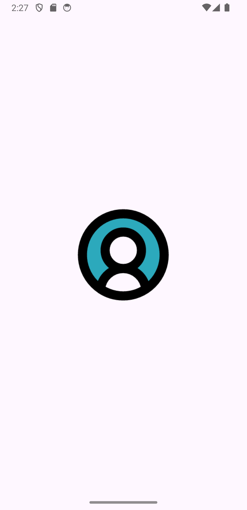
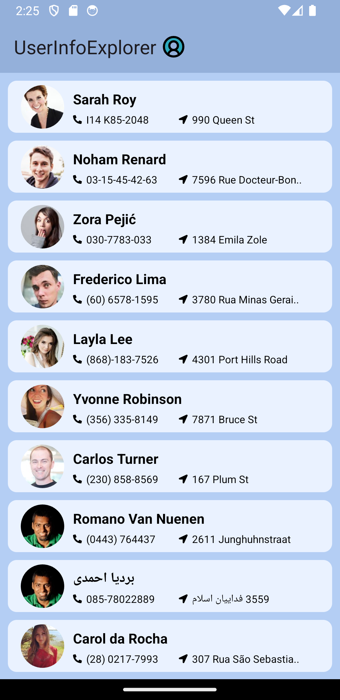
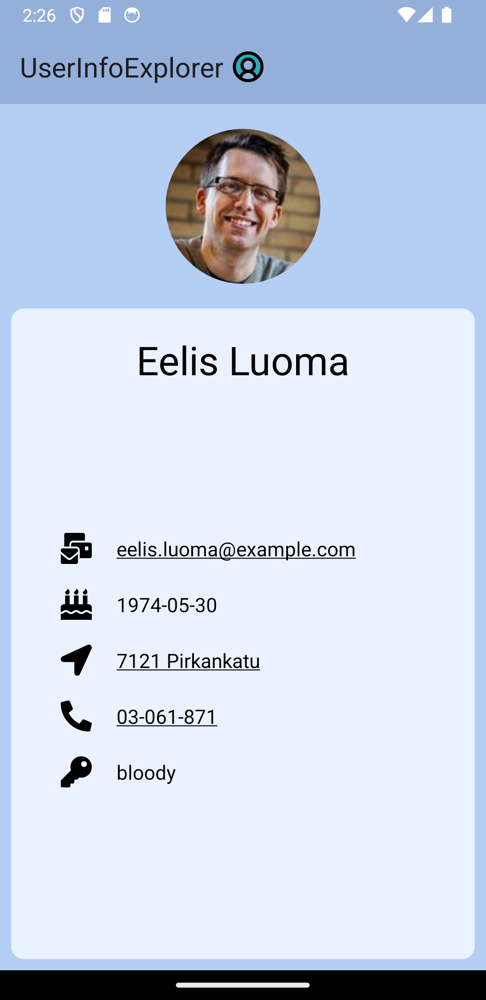

# UserInfoExplorer
UserInfoExplorer - это приложение, которое отображает данные, полученные от [RandomUser API] (https://randomuser.me), в виде списка карточек. Клик по каждой карточке переносит пользователя на экран с более подробной информацией о пользователе. Клик по почте, адресу или номера телефона переносит пользователя в соответствующее приложение.  

## Требования 
В рамках разработки данного Android-приложения ставились следующие требования:

1. Вывод краткой информации о пользователях (ФИО, фотография, адрес, номер телефона) в виде списка, полученной от RandomUser API.
2. По клику на элемент списка на отдельном экране показывается полная информация о выбранном пользователе.
3. Сохранение данных о пользователях при перезапуске приложения.
4. Переход к приложениям для обработки данных по нажатию на Email, номер телефона, адрес/координаты (почта, звонилка, карты).
5. Принудительное обновление списка пользователей.
6. Уведомления о возникших ошибках при загрузке данных или работе с ними.
7. Первые три функции обязательны. Реализация функций 4–6 увеличит шанс на успешное прохождение курса.

## Использованные технологии
Язык программирования: Kotlin
Архитектурный паттерн: MVVM (Model-View-ViewModel)
Библиотеки:
Retrofit - для взаимодействия с сетью
Moshi - для работы с JSON
ViewModel и LiveData - для реализации архитектурного паттерна MVVM
Navigation Component - для реализации навигации  
Picasso - для загрузки и отображения изображений
Корутины (Coroutines) - для асинхронных операций
Material Components - для дизайна пользовательского интерфейса

## Скриншоты 

## Запуск проекта
1. Клонируйте репозиторий на свой компьютер.
2. Откройте проект в Android Studio.
3. Запустите приложение на эмуляторе или физическом устройстве.